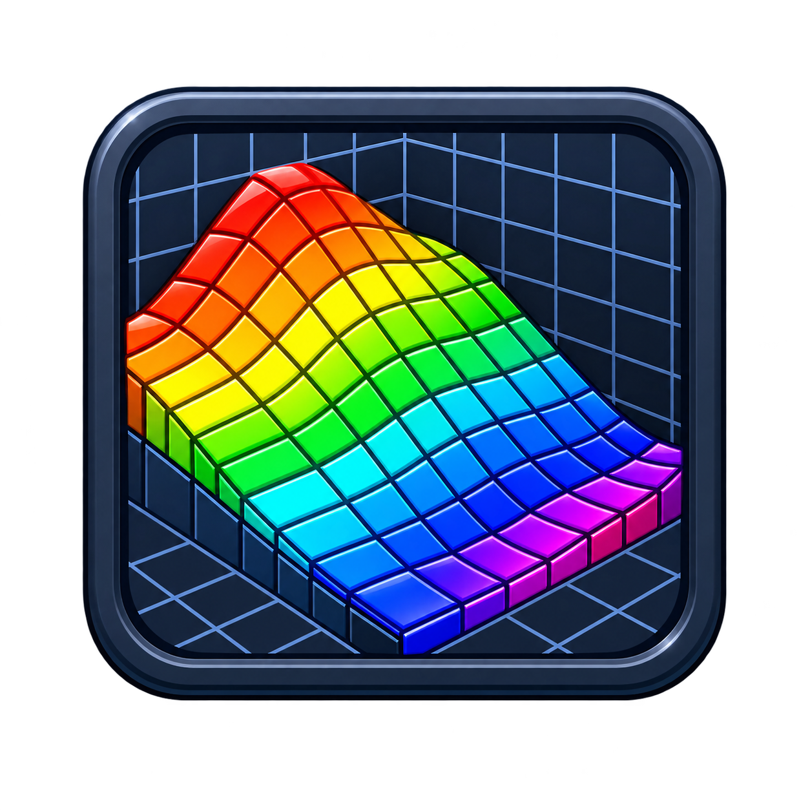

[README.md](https://github.com/user-attachments/files/31862759/README.md)
# Map Lab

<p align="center">
  
</p>

<p align="center">
  A Windows desktop workspace for building, editing, smoothing, and visualizing engine calibration maps.
</p>

<p align="center">
  <a href="https://github.com/MrFrickinFixit/MapLab/releases"></a>
  
  
  
</p>

Map Lab combines spreadsheet-style 2D tables with interactive 3D surfaces. It supports ignition timing, volumetric-efficiency fueling, learned corrections, and general-purpose custom maps in one saved workspace.

> [!WARNING]
> Engine calibration can damage an engine, drivetrain, or vehicle when values are incorrect. Independently verify every generated or modified map and use appropriate safeguards before applying it to an ECU.

## Highlights

- Separate **Fueling**, **Ignition Timing**, **Learn Apply**, and **Map Sandbox** workspaces.
- Adjustable matrix dimensions with independently editable X/RPM and Y/MAP breakpoint scales.
- MAP units in PSI gauge or kPa absolute, plus custom axis units in Map Sandbox.
- Drag selection, Ctrl+click/Ctrl+drag additive selection, group editing, and clipboard transfer to and from tuning software.
- Standard row and column smoothing, interpolation, transition rings, smoothing to surroundings, and advanced shape-preserving or edge-preserving algorithms.
- Timing-region boundaries, regional profiles, and boost timing offsets calculated from each selected row's actual MAP breakpoint—even when the PSI scale is nonlinear.
- VE setup wizard with naturally aspirated and forced-induction modes, configurable MAP sensors, preview, contour generation, and final whole-map smoothing.
- Optional calculated lb/hr view for the Fueling table while retaining editable VE% source values.
- Interactive 3D selection, crosshairs, tooltips, sculpting, and flatten/smooth-between-points tools.
- Independent Undo/Redo history for each table and its corresponding 3D viewer.
- CSV and Excel export, including timing-value heat-map formatting in Excel.
- `.map` workspace files, Save/Save As, recovery autosave, and a prompt for unsaved changes when closing.
- Built-in Help with Contents, an alphabetical Index, live search, and `F1` access.

## Install Map Lab

1. Open the [Map Lab Releases page](https://github.com/MrFrickinFixit/MapLab/releases).
2. Download the current `MapLab-<version>-beta-win-x64-setup.exe` asset.
3. Run the installer and choose:
   - installation for the current user or all users;
   - the installation folder;
   - whether to add a desktop shortcut;
   - whether to add Map Lab to the Start/Programs menu.

The installer contains a self-contained 64-bit Windows build, so a separate .NET runtime installation is not required. Map Lab currently requires Windows 10 or newer.

> [!NOTE]
> GitHub may mark a release tag as **Verified** because its Git tag has a valid cryptographic signature. That is separate from Windows Authenticode signing. The installer is not currently Authenticode-signed, so Windows SmartScreen may display an unknown-publisher warning.

## Quick start

1. Choose **Fueling**, **Ignition Timing**, or **Map Sandbox**.
2. Set the matrix dimensions and edit or paste the X and Y breakpoint scales.
3. Paste a map, or drag across cells to select an area and enter values manually.
4. Use the smoothing and interpolation tools where needed.
5. Inspect the surface with **3D View**.
6. Save the complete workspace as a `.map` file, or export an individual table to CSV or Excel.

To assign one value to a group, select the cells, edit any cell in that selection, and press **Enter**. Clicking away cancels a pending group edit. After a successful table paste, the selection is cleared.

### Keyboard shortcuts

| Shortcut | Action |
| --- | --- |
| `Ctrl+A` | Select every cell in the active table |
| `Ctrl+C` | Copy selected cells |
| `Ctrl+V` | Paste cells or focused axis values |
| `Ctrl+Z` | Undo the active table's last change |
| `Ctrl+Y` | Redo the active table's last undone change |
| `Ctrl+O` | Open a `.map` workspace |
| `Ctrl+S` | Save the current workspace |
| `Ctrl+Shift+S` | Save As |
| `F1` | Open Help and focus Search |
| `Enter` | Commit a cell or axis edit |
| `Escape` | Cancel boundary selection or an active 3D sculpt preview |

## Clipboard interoperability

Map Lab accepts tab-, comma-, semicolon-, or whitespace-delimited numeric data. A complete copied table can be pasted into a selected block, while a single copied row or column can be pasted directly into a selected axis range. Pasted values and direct table-cell edits are retained exactly as entered and are not rounded by display formatting or autosave. Changing an Actual Precision control later explicitly rounds the corresponding table. PSI axes can use one decimal place, while kPa and RPM normally use whole-number formatting.

The axis orientation used by Map Lab is:

- **X axis:** Engine RPM (or a custom Sandbox X unit)
- **Y axis:** MAP (or a custom Sandbox Y unit)
- **Z axis:** Table value

## Build from source

### Requirements

- Windows 10 or newer
- [.NET 8 SDK](https://dotnet.microsoft.com/download/dotnet/8.0)
- [Inno Setup 6](https://jrsoftware.org/isinfo.php) to create the full installer

### Build the application

```powershell
git clone https://github.com/MrFrickinFixit/MapLab.git
cd MapLab
dotnet build MapLab.slnx -c Release
```

### Build the installer

```powershell
pwsh -NoProfile -File .\scripts\build-inno-installer.ps1
```

The script publishes a self-contained `win-x64` application and writes the setup program under `artifacts\inno\installer`. If Inno Setup is installed in a nonstandard location, supply `-CompilerPath` with the full path to `ISCC.exe`.

The current source tree identifies the development build as **1.0.3.3-beta**. Check the [Releases page](https://github.com/MrFrickinFixit/MapLab/releases) for the latest published package.

## Repository layout

| Path | Purpose |
| --- | --- |
| `MainWindow.xaml` / `MainWindow.xaml.cs` | Main application shell, tabs, file commands, and workspace coordination |
| `FuelingPanel.cs` | Fueling and VE table workflow |
| `SandboxPanel.cs` | Custom matrix and axis workspace |
| `Surface3DWindow.cs` | Interactive 3D surface viewer and editor |
| `AdvancedSmoother.cs` | Advanced smoothing implementations |
| `Help/MapLabHelp.json` | Searchable in-application help content |
| `Installer/MapLab.iss` | Full Inno Setup installer definition |
| `scripts/` | Build, validation, performance, and feature test scripts |

## Release verification

Published releases can use a signed Git tag that GitHub displays as **Verified**. To inspect a downloaded asset independently, calculate its SHA-256 digest and compare it with the checksum published alongside that release:

```powershell
Get-FileHash .\MapLab-<version>-beta-win-x64-setup.exe -Algorithm SHA256
```

## Help and feedback

Press `F1` inside Map Lab for searchable instructions covering table editing, axes, smoothing, timing regions, boost offsets, VE setup, Learn Apply, 3D tools, saving, and exporting.

For bugs or feature requests, use [GitHub Issues](https://github.com/MrFrickinFixit/MapLab/issues). When reporting a problem, include the Map Lab version, Windows version, steps to reproduce it, and the complete exception text when available. Do not attach proprietary calibration data unless you are authorized to share it.

## Support Map Lab

Map Lab is provided free of charge. If it has been useful to you, you may optionally [support its continued development through PayPal](https://www.paypal.com/paypalme/bdiffenbaugh).

Contributions are voluntary, are not purchases, do not unlock features or change the Map Lab license, and do not guarantee technical support, calibration advice, or future development. They are not tax-deductible charitable donations.

## License

Copyright © 2026 Brian Diffenbaugh. Map Lab is freeware but is **not open-source software**. Personal, educational, and commercial use is permitted without a purchase fee; redistribution, modification, sublicensing, sale, and reverse engineering are restricted except where applicable law permits otherwise. See [LICENSE.txt](LICENSE.txt) for the complete terms.
